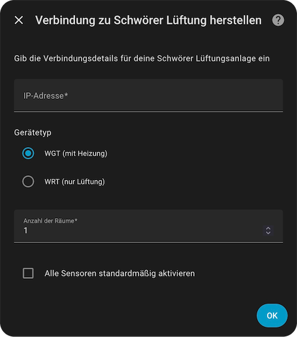
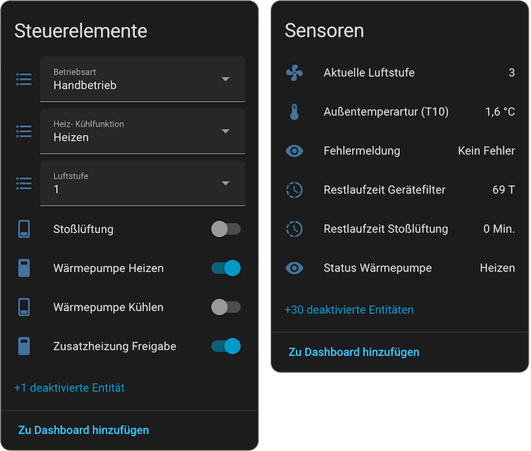
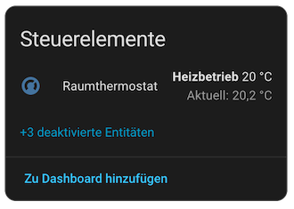

# Schwörer Lüftung Integration for Home Assistant

[](https://github.com/josa42/homeassistant-schwoerer-lueftung/releases)
[](LICENSE)
[](https://hacs.xyz/)

A Home Assistant integration for [Schwörer](https://www.bauinfocenter.de/lueftung) ventilation and heating systems through Modbus TCP.

<br><br>

## Supported Devices

This integration supports Schwörer ventilation systems that communicate via Modbus TCP:

- **WGT (Wärmerückgewinnung mit Heizung)** - Ventilation with heat recovery and heating
- **WRT (Wärmerückgewinnung)** - Ventilation with heat recovery only

Both device types provide comprehensive monitoring and control of your ventilation system. WGT models include additional heating/cooling capabilities with multi-room climate control.

<br><br>

## Features

Control and monitor your Schwörer ventilation system with comprehensive Home Assistant integration supporting multiple operation modes, fan speed control, and 28+ sensors for system monitoring. WGT models add multi-room climate control with heat pump heating/cooling and per-room temperature management for up to 17 rooms.

<br><br>

## Installation

[](https://my.home-assistant.io/redirect/hacs_repository/?owner=josa42&repository=homeassistant-schwoerer-lueftung)

### Requirements
- Home Assistant **2026.1.0** or newer
- Schwörer ventilation system with Modbus TCP connectivity
- Network connection to your ventilation unit

### HACS (Recommended)

1. Ensure [HACS](https://hacs.xyz/) is installed in your Home Assistant instance
2. Open HACS → Integrations
3. Click the three dots menu (top right) → Custom repositories
4. Add repository URL: `https://github.com/josa42/homeassistant-schwoerer-lueftung`
5. Category: Integration
6. Click "Add"
7. Click "Download" on the Schwörer Lüftung card
8. Restart Home Assistant

### Manual Installation

1. Download the latest release from [GitHub releases](https://github.com/josa42/homeassistant-schwoerer-lueftung/releases)
2. Extract the `custom_components/schwoerer_lueftung` folder
3. Copy it to your Home Assistant `custom_components` directory:
   ```
   config/
   └── custom_components/
       └── schwoerer_lueftung/
   ```
4. Restart Home Assistant

<br><br>

## Configuration

### Adding the Integration

1. Go to **Settings** → **Devices & Services**
2. Click **+ Add Integration**
3. Search for "Schwörer Lüftung"
4. Follow the configuration steps:



#### Configuration Options

| Option                        | Description                                                   | Default  |
|-------------------------------|---------------------------------------------------------------|----------|
| **Host**                      | IP address of your Schwörer system                            | Required |
| **Device Type**               | WGT (with heating) or WRT (ventilation only)                  | WGT      |
| **Number of Rooms**           | Rooms with climate control (1-17)                             | 1        |
| **Has ground heat exchanger** | Enable if your system has a ground heat exchanger (EWT)       | Off      |
| **Enable All Sensors**        | Enable all sensors by default (otherwise some are disabled)   | Off      |

> [!TIP]
> Set "Enable All Sensors" to ON if you want access to detailed diagnostic information like operating hours and additional temperature sensors. These can be disabled individually later.

<br><br>

## Entities

The integration creates various entity types depending on your device model:

### Central Entities

System-wide controls and monitoring:



<br><br>

| Type            | Entity                          | Description                                                    |
|-----------------|---------------------------------|----------------------------------------------------------------|
| **Sensor**      | Fan Level                       | Current fan speed (Off, Level 1-4)                             |
|                 | Supply Air Flow                 | Supply air flow percentage                                     |
|                 | Exhaust Air Flow                | Exhaust air flow percentage                                    |
|                 | Supply Fan Speed                | Supply fan rotation speed (RPM)                                |
|                 | Exhaust Fan Speed               | Exhaust fan rotation speed (RPM)                               |
|                 | Temperature T1-T10              | Multiple temperature sensors (outdoor, supply, exhaust, etc.)  |
|                 | Filter Remaining (Device)       | Device filter life in days                                     |
|                 | Filter Remaining (Upstream)     | Upstream filter life in days                                   |
|                 | Operating Hours                 | Runtime tracking (fan, heat pump, heating elements)            |
|                 | Supply Air Fan Status           | Fan state (Disabled/Startup/Active/Standby/Error)              |
|                 | Exhaust Air Fan Status          | Fan state (Disabled/Startup/Active/Standby/Error)              |
|                 | Error Message                   | System error reporting                                         |
|                 | Time Program Base Level         | Programmed base ventilation level                              |
|                 | Shock Ventilation Remaining     | Remaining boost mode time (minutes)                            |
|                 |                                 |                                                                |
| **Binary**      | Door Open                       | Door open alarm                                                |
|                 | Device Filter Dirty             | Device filter replacement notification                         |
|                 | Upstream Filter Dirty           | Upstream filter replacement notification                       |
|                 | Emergency Mode                  | Emergency mode indicator                                       |
|                 | Outdoor Damper                  | Outdoor damper state (open/closed)                             |
|                 | Fan Override                    | Fan override mode active                                       |
|                 | Reheater Active (WGT)           | Reheater element status                                        |
|                 | Preheater 1/2 Active (WGT)      | Preheater element status                                       |
|                 |                                 |                                                                |
| **Select**      | Operation Mode                  | Off / Manual / Winter / Summer / Summer Exhaust                |
|                 | Manual Fan Speed                | Off / Level 1-4 / Automatic / Linear Mode                      |
|                 | Heating/Cooling Function (WGT)  | Off / Heating / Cooling / Auto (outdoor) / Auto (digital)      |
|                 |                                 |                                                                |
| **Number**      | Linear Fan Power                | Manual linear fan control (30-100%)                            |
|                 |                                 |                                                                |
| **Switch**      | Shock Ventilation               | Temporary boost mode                                           |
|                 | Heat Pump Heating (WGT)         | Enable/disable heat pump heating                               |
|                 | Heat Pump Cooling (WGT)         | Enable/disable heat pump cooling                               |
|                 | Auxiliary Heating System (WGT)  | Enable/disable auxiliary heating system-wide                   |

<br><br>

### Per-Room Entities

Individual room controls (one set per configured room):



<br><br>

| Type            | Entity                           | Description                                        |
|-----------------|----------------------------------|----------------------------------------------------|
| **Sensor**      | Room Temperature                 | Current room temperature sensor                    |
|                 |                                  |                                                    |
| **Climate**     | Room Climate (WGT)               | Room temperature control (10-30°C, HVAC mode)      |
|                 |                                  |                                                    |
| **Number**      | Room Base Temperature (WGT)      | Room baseline temperature setpoint (10-30°C)       |
|                 |                                  |                                                    |
| **Binary**      | Auxiliary Heating Enabled (WGT)  | Room auxiliary heating enabled status              |
|                 | Auxiliary Heating Active (WGT)   | Room auxiliary heating active status               |
|                 |                                  |                                                    |
| **Switch**      | Auxiliary Heating (WGT)          | Enable/disable auxiliary heating for this room     |
|                 | Time Program Heating (WGT)       | Enable/disable time-programmed heating for room    |

> [!NOTE]
> Entities marked **(WGT)** are only available on WGT (heating) models. WRT models provide ventilation monitoring and control only.

<br><br>

## Troubleshooting

### Logs

Enable debug logging by adding to `configuration.yaml`:

```yaml
logger:
  default: info
  logs:
    custom_components.schwoerer_lueftung: debug
```

<br><br>

## License

MIT License - see [LICENSE](LICENSE) file for details.

<br><br>

## Disclaimer

This is an unofficial integration and is not affiliated with or endorsed by Schwörer Haus KG.
